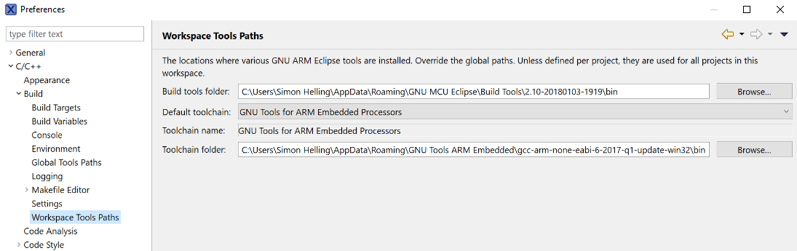
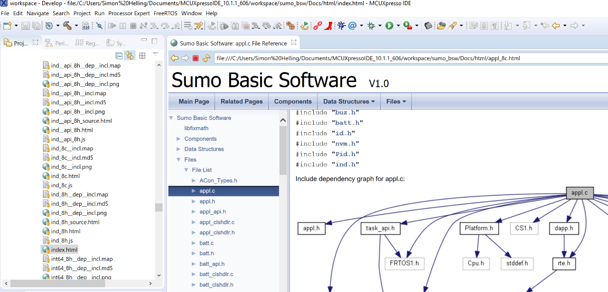

.. _Installation Guide:

==================
Installation guide
==================
This documentation guides you through the installation of required software to get you 
run the robot and/or develop new basic software (BSW) components for the ACON Sumo robot.

.. hint:: 	If you run into any problems, these blog entries from Prof. Erich Styger might help:
				1. `Importing Kinetis Design Studio Projects <https://mcuoneclipse.com/2017/04/02/mcuxpresso-ide-importing-kinetis-design-studio-projects/>`_
				2. `Installing Processor Expert <https://mcuoneclipse.com/2017/04/09/mcuxpresso-ide-installing-processor-expert-into-eclipse-neon/>`_
				3. `MCUXpresso IDE 10.1 <https://mcuoneclipse.com/2017/11/25/eclipse-mcuxpresso-ide-10-1-with-integrated-mcuxpresso-configuration-tools/>`_
				
			Also, take a look at the `GNU ARM/MCU Eclipse documentation <https://gnu-mcu-eclipse.github.io/>`_	
	
#################
Required accounts
#################
I. GitHub account
	This gets you access to the Sumo BSW repository containing all the source files
II. NXP account
	This is mandatory to download and install the MCUXpresso IDE
	
######################
Toolchain and Software
######################
:ref:`install MCUXPresso`
	This is the eclipse-based integrated development environment (IDE) in which you write your code,
	flash the Sumo, debug, etc...
:ref:`installSmartGit` (optional but recommended)
	This client will help you to manage your file history in the process of making new software components. 
	Skip this if you already use some sort of client for git or you prefer command-line tools.
:ref:`install FreeMaster`
	This is a user-friendly real-time debug monitor and data visualization tool that lets you access data via USB- or Bluetooth-connection to the Sumo. It can be used for application development and information management.
	
	.. note:: If you want to use FreeMASTER, then you **must** use a Windows platform, since FreeMASTER
			  is only available for Windows.

.. _install MCUXpresso:

I. MCUXpresso IDE
-----------------
The hardware of the Sumo robot was designed and developed by the group of Prof. Erich Styger at the Lucerne School
Of Engineering And Architecture. For this reason the installation process of the MCUXpresso IDE will include parts from his blog
`MCU on eclipse`_. 

Go to the `MCUXpresso download page <https://www.nxp.com/support/developer-resources/software-development-tools/mcuxpresso-software-and-tools/mcuxpresso-integrated-development-environment-ide:MCUXpresso-IDE>`_
and download the newest version available. Be aware that these steps require an NXP-account. After the succesful registristration, just follow the installation steps. 

.. note:: This should also install the *Segger J-LinkSoftware And Documentation Pack*, which you 
		  is required to debug and communicate with the Sumo via the *RTT-Viewer* tool. If the 
		  installation failed for some reason, you can download the package 
		  `here <https://www.segger.com/downloads/jlink/#J-LinkSoftwareAndDocumentationPack>`_ .

The next step is needed because the Sumo uses Processor Expert (PEx), a software tool to generate (low-level)
code on the fly. This is generically not supported by the new IDE *MCUXpresso* from NXP as PEx originates from the Kinetis 
Design Studio IDE. It is still possible to import projects that use this feature. However, one cannot (yet) configure/produce new
files with Processor Expert in MCUXpresso. PEx, in turn, is based on *GNU tools* for compilation and building.

(i). GNU ARM Toolchain
**********************
Follow `this link <https://developer.arm.com/open-source/gnu-toolchain/gnu-rm/downloads>`_ and download 
the file *gcc-arm-none-eabi-6-2017-q1-update-win32.zip* from February 23, 2017.

.. note:: You can try to download the newest version of the *GNU Arm Embedded Toolchain*, but this has not been tested.

Open the archive and extract the *gcc-arm-none-eabi-6-2017-q1-update-win32* folder to 
*~/Appdata/Roaming/GNU ARM Embedded* 

.. note:: By default, the *Appdata* directory is not visible. You can get to the directory by typing \"%APPDATA%\" 
			into an Explorer window and pressing enter
			
				.. figure:: images/appdata.PNG
	
				Getting to the *Appdata* directory

.. hint:: In order to check if the *GNU ARM gcc compiler* is installed properly, open a *Terminal* window, change directory to *~/AppData/Roaming/GNU ARM Embedded/
			gcc-arm-none-eabi-6-2017-q1-update-win32/bin* (by using the command \"cd\") and type \"arm-none-eabi-gcc --version\". 
			
				.. figure:: images/gcctest.PNG

				Checking if the *ARM C compiler* is installed correctly.

(ii). Windows Build Tools
*************************
.. note:: This step is only necessary if you use a Windows as OS.

These tools seem necessary, since Windows does not provide *make* by
default. The installation process is similar to the one before. Visit `this website <https://github.com/gnu-mcu-eclipse/windows-build-tools/releases>`_
and download the *gnu-mcu-eclipse-build-tools-x.xx-xxxxxxxx-xx-win64.zip* file. Extract the *GNU MCU Eclipse* folder
to the path *~/Appdata/Roaming/GNU MCU Eclipse*.

.. hint:: In order to check if the *GNU MCU Eclipse Windows Build Tools* are installed correclty, open a *Terminal* window, change directory to *~/AppData/
			Roaming/GNU MCU Eclipse/Build Tools/2.10-20180103-1919/bin* (by using the command \"cd\") and type 
			\"make --version\". 
			
				.. figure:: images/maketest.PNG

				Checking if the *GNU MCU Eclipse Windows Build Tools* are functional.
				
(iii). GNU MCU Eclipse plugin
*****************************
The Eclipse environment requires the installation of the GNU MCU Eclipse plugin within the MCUXpresso IDE. According to the `GitHub Wiki <https://gnu-mcu-eclipse.github.io/plugins/install/>`_ of the GNU MCU Eclipse tools 
the versions *4.x* are only supported back to *Eclipse 4.6 with C Developing Tools (CDT) 9.2*. For the time being the latest version of MCUXpresso is 10.1.1 Build 606 2018-01-02, Eclipse 4.6.3v20170301-0400 (Neon) with CDT 9.1.0.201609121658. 
Consequently the latest GNU MCU Eclipse version would not install correctly. Prof. Erich Styger recommends in his blogs to instal the `GNU ARM/MCU Eclipse plug-ins version 3.4.1  <https://github.com/gnu-mcu-eclipse/eclipse-plugins/releases/tag/v3.4.1-201704251808>`_ , which 
worked for the time being. Please check the current MCUXpresso version/Built available and the compatibility at the GNU MCU Eclipse tools GitHub Wiki.

If the *.zip*-file, open *MCUXpresso->Help->Install New software* was downloaded, put the file into the upcoming window via *drag\&drop*. It should 
now show up as shown in the picture. Mark the box and finish the installation.

.. figure:: images/installnewsoftware.PNG

	How to install new software in MCUXpresso.

.. figure:: images/installgnumcueclipse.PNG

	*Drag \& drop* the *.zip*-file to the window, check the box and finish the installation.
				
				
(iv). Configuration of the MCUXpresso IDE for the ARM toolchain
***************************************************************
In this step it is ensured that MCUXpresso *knows* where to search for the *ARM Toolchain* and the *Windows Build Tools* (if you use Windows). This can
be accomplisehd by configuring the Preferences of the IDE. Go to *Window->Preferences*, expand *C/C++*, expand *Build* and go to *Workspace Tools Paths*. As shown in the picture, the Toolchain should be
set to the *GNU Tools for ARM Embedded Processors*. You may need to copy the path to the *Windows Build Tools* and the *GNU ARM Toolchain* manually. Click *Apply* and *OK*.

	
	Tool chain preferences for the C build. You may need to copy the paths manually into the boxes.

	
.. note:: This way you set the default Toolchain for all projects in the workspace. If you dont want that, you can set them for each project individually in the
			project settings.
				
	
(v). Configuration of the MCUXpresso IDE for Processor Expert (PEx) integration
*******************************************************************************
If MCUXpresso v10.1 or newer is used, it is required to remove the *MCUCpresso IDE Configuration Tools* in order to avoid conflicts between the *Configuration Tools* and PEx. 
Therefore go to *Help->Installation Details* and search for *MCUXpresso IDE Configuration Tools Integration*, select it, and click *Uninstall*.

.. figure:: images/uninstallconfigurationtools.PNG
	
	Uninstall the *Configuration Tools* to avoid conflicts with PEx.
	
Now, go to the `Processor Expert Download Page <https://www.nxp.com/pages/processor-expert-software-microcontroller-driver-suite:PE_DRIVER_SUITE?&&tab=Design_Tools_Tab>`_ 
and download the *Processor Expert for Kinetis v3.0 Eclipse plugin* 

.. figure:: images/processorexpertplugin.PNG

	Download the PEx plugin *.zip*-file.
	
After unzipping this file, install the *freescale_updater.zip*-file insided the MCUExpresso IDE. Got to *Help->Install New Software* as described above, e.g. for the installation of the GNU MCU Eclipse plugin.

.. attention:: You must install the *freescale updater*-file first! 

.. figure:: images/freescaleupdaterfirst.PNG

	Install the marked file from the *Processor Expert for Kinetis v3.0 Eclipse plugin*-file first. Then install *PEx for Kinetis v3.0.0*.

Afterwards, install *PEx for Kinetis 3.0.0* in the same way. Repeat this steps for the patch *Processor Expert for Kinetis v3.0.2 update*.

.. figure:: images/processorexpertupdate.PNG
	
	Install the update *PEx for Kinetis 3.0.2*
	
In the final step download the PEx components from Prof. Stygers 'Sourceforge repo <https://sourceforge.net/projects/mcuoneclipse/files/PEx%20Components/>`_ 
Check the current version of Sumo Robot Project and download the fitting release (currently *Components 2017-12-26.zip* (14.03.2018)). Unzip
the file, in MCUExpresso go to *Processor Expert->Import Components* search and select the *.PEupd*-files and click *import*.

.. figure:: images/processorexpertimportcomponents.PNG
	
	Install the PEx components from Prof. Styger's repo at Sourceforge.

.. _importsumoproject:

(vi). Import the Sumo BSW sources
*********************************
In order to verify everything is set up correctly import the Sumo project source code. If the SmartGit client is installed and the steps according to :ref:`installSmartGit` were performed correctly,
it is possible to open the project inside MCUXPresso by selecting *File->Open Projects from File System* as illustrated in the figure below

.. figure:: images/openproject.PNG
	
	Import the project in the MCUXpresso IDE.

If there is no *Generated Code* folder in the project, go to *Processor Expert->Show Views* and click *Generate Processor Expert Code* as shown below.

.. figure:: images/generatecode.PNG

	If **NO** *Generated Code* folder exists, hit *Generate Processor Expert Code*.

This process may take a while and generates all the low-level code for the required components of the Sumo BSW Project. When finished click *Edit \'sumo_bsw project settings\'*
(you need to have the project selected to do this) and expand *C/C++ build*. The configuration of *Settings, Tool Chain Editor,* and *Tool Paths* should look like as in the pictures below
	
.. figure:: images/projectsettings1.PNG

	The target processor should be *cortex-m4*. If it does not exist go to the *MCU settings* and select *Generic-M4*.
	
.. figure:: images/projectsettings2.PNG

	Since the ARM toolchain is used *Cross ARM GCC* should be selected.
	
.. figure:: images/projectsettings3.PNG
	
	The *Tool Path* should be set to *GNU Tools for ARM Embedded Processors*.
	
	
.. _includedoxygen:

(vii). Integration of the eclox plugin for documentation
********************************************************
Doxygen is used to write code documentation for the project. For the  integration to MCUXpresso go to the *Eclipse Marketplace* and search and install
*Eclox*.

.. figure:: images/eclox.PNG

	Eclox integrates doxygen support to the MCUXPresso IDE.
	
Since doxygen uses the *dot* language and *GraphViz*, respectively, one needs to `download Graphviz <https://graphviz.gitlab.io/_pages/Download/Download_windows.html>`_
,e.g., *graphviz-2.38.zip*. Unpack the content of the *release*-folder to \"*~/Program Files(x86)/Graphviz2.38*\". Now make sure that the *sumo_bsw.doxyfile*, which is
located in the folder *Docs* in the *sumo_bsw project*, is set up correctly by double-clicking it. 

.. note:: If you haven't imported the Sumo_BSW project repository to your workspace yet, see :ref:`installSmartGit` and :ref:`importSumoProject`.

Go to the *Advanced* tab and search for *DOT Path*. This must contain the
path to the *dot.exe* in the *Graphviz* directory as shown in the picture.

.. figure:: images/doxyfilepreferences.PNG

	The *DOT Path* must be correct in order to get doxygen working correctly.

To try if Eclox works, you can generate the documentation as a test. To do this, click the blue \@-symbol in the toolbar or, alternatively, right-click the
*sumo_bsw.doxyfile* in *sumo_bsw->Docs* and click *Build documentation* as described in the picture below.

.. figure:: images/generatedocs.PNG

	There are two ways to generate the documentation files: hit the \@-symbol or right-click the doxyfile and *Build documentation*.

This should generate several files in the *html*-folder. Double-clicking the *index.html*-file opens the documentation. Search for an arbitrary file and if
you see something like in the picture below, everything works fine (given you don't have an error output).

	The Eclox plugin including the *dot tool* works fine, if there are graphs showing dependencies for any arbitrary c- or h-file.
	
.. hint:: If Eclox/doxygen still generates an error like \"*error: problems running dot exit code=-1*\" then try to set the PATH variable, so Eclox can
			find the *dot.exe*. This can be achieved by *right-clicking the Windows symbol->System->System info->Advanced System Settings->Environment Variables->PATH*
			and adding the path to the *bin*-folder of the dot tool. Then restart MCUXpresso.
				
				.. image:: images/pathvariable.PNG

.. _install FreeMaster:

II. FreeMASTER Debug Tool
-------------------------
Visit the `FreeMaster download page <https://www.nxp.com/support/developer-resources/software-development-tools/freemaster-run-time-debugging-tool:FREEMASTER?tab=Design_Tools_Tab>`_
and download the *FreeMASTER 2.0 Application Installation*-file. Execute the file and select *complete installation*.

.. figure:: images/freemasterinstall.PNG

	Download and install the FreeMaster.

.. URLs
.. _`MCU on eclipse`: https://mcuoneclipse.com/
.. _`FreeMaster`: https://www.nxp.com/support/developer-resources/software-development-tools/freemaster-run-time-debugging-tool:FREEMASTER
.. _`MCUXpresso`: https://www.nxp.com/support/developer-resources/software-development-tools/mcuxpresso-software-and-tools/mcuxpresso-integrated-development-environment-ide:MCUXpresso-IDE
.. _`SmartGit`: https://www.syntevo.com/smartgit
.. _`URL to the Sumo BSW`: https://github.com/gfre/sumo_bsw

.. _installSmartGit:

III. SmartGit Client
--------------------

.. note:: If you use other version control software you can skip this. In that case, all you need is the `URL to the Sumo BSW`_ and clone
			the entire repo to *~/Documents/MCUXpressoIDE_xx.x.x_xxx/workspace/sumo_bsw*.

Follow this `link <https://www.syntevo.com/smartgit/>`_ and download SmartGit. Install SmartGit for *non-commercial use only*.
	
.. figure:: images/smartgit1.PNG
	
	Installing SmartGit under the *non-commercial license*.

Afterwards, select SmartGit as your SSH-Client and GitHub as your hosting provider. For this, you need to generate an *API Token*
that identifies you with your GitHub account. 

.. figure:: images/smartgit2.PNG
	
	Selecting GitHub as your hosting provider and verifying your account.
	
After clicking *Generate API Token* you will be redirected to a website with your 
API token on it. Copy this token in the Token field and go on. SmartGit will then ask you what to do next. Hit *clone existing repository*
and enter the `URL to the Sumo BSW`_ . You may have to enter your GitHub password for this.
Finally, select the location on your disk where the Repo will be cloned into.
I recommend to clone it to *~/Documents/MCUXpressoIDE_xx.x.x_xxx/workspace/sumo_bsw*.
You should now have all the source files in that directory.

In order to document the code using doxygen (see :ref:`includedoxygen`), we use the *gh-pages* branch from the Sumo repo to update the doxygen files.
Therefore we define a new, local repo *html* that we place inside the *Sumo BSW repo*\'s *Doc*-folder. To achieve this, check out to the 
master or development branch of the Sumo repo in SmartGit. Then, create a new folder in the *sumo_bsw/Docs/*-directory. In SmartGit, select
*Repository->Clone* and similar to above, select the GitHub Website for the sumo_bsw repo. But now, select the *gh-pages*-branch as shown below.

.. figure:: images/smartgit_githubpages.PNG

	Check out to the *gh-pages*-branch when creating the new *html*-repo.
	
Now select the *html*-folder that you just created and you are done!

