===========
User guide
===========
This section guides you through the means to communicate with the Sumo robot. This can be done in several
ways that are described in the following three sections. It is assumed that you have installed the software
according to the Installation Guide.

:ref:`Debugging with MCUXpresso`
	With this, you can set breakpoints, execute code line by line, work your way through functions, and
	watch certain global and local variables at certain points in time.
:ref:`Communicating via J-Link RTT Viewer` 
	This tool provides the means to change and view run-time properties of the Sumo through the command line shell.
	For instance, you can let a LED blink, change the filter that is used to calculate the Sumo's speed, check the
	battery status, and much more.
:ref:`Debugging with FreeMaster`
	FreeMaster lets you view (global) variables of the Sumo robot with a graphical user interface through the 
	*J-Link Edu Debug Probe* or a Bluetooth connection, respectively. As an example, you can plot the position and/or 
	speed of the Sumo as a function of time. Additionally, you can export data as text files if you want to 
	investigate the data in further detail (e.g. in MATLAB).

	
.. _Debugging with MCUXpresso:

Debugging with MCUXpresso
=========================
This way is the most *traditional* way of debugging code. This is useful if you wrote new code and want to test its
functionality and/or check for bugs by analyzing the code line by line. To do this, open MCUXpresso and in the *QuickStart
Panel* view, click **Clean** and afterwards **Build** as shown below. 

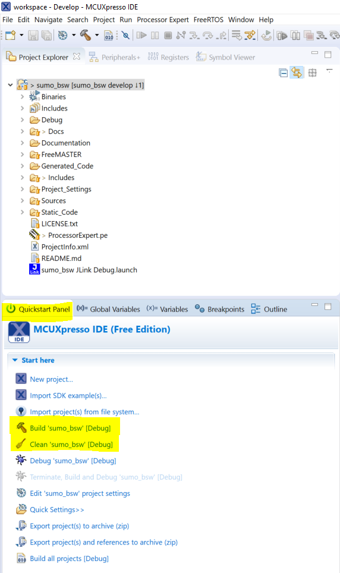
	
	Clean and Build the Sumo project to invoke the compiler and linker.
	
This will link and compile the Sumo project. Now, connect the *J-Link Edu Debug Probe* to your PC and to the Sumo robot.
To set up the debug connection, hit the **blue** debug button, not the green one. You can find this button in the
*QuickStart Panel* view and in the menu toolbar. The difference between these two is that the blue one automatically
detects debug probes (such as the *J-Link Edu Debug Probe*) and configures a debug launch configuration automatically, 
whereas the green button needs a pre-configured launch configuration. 

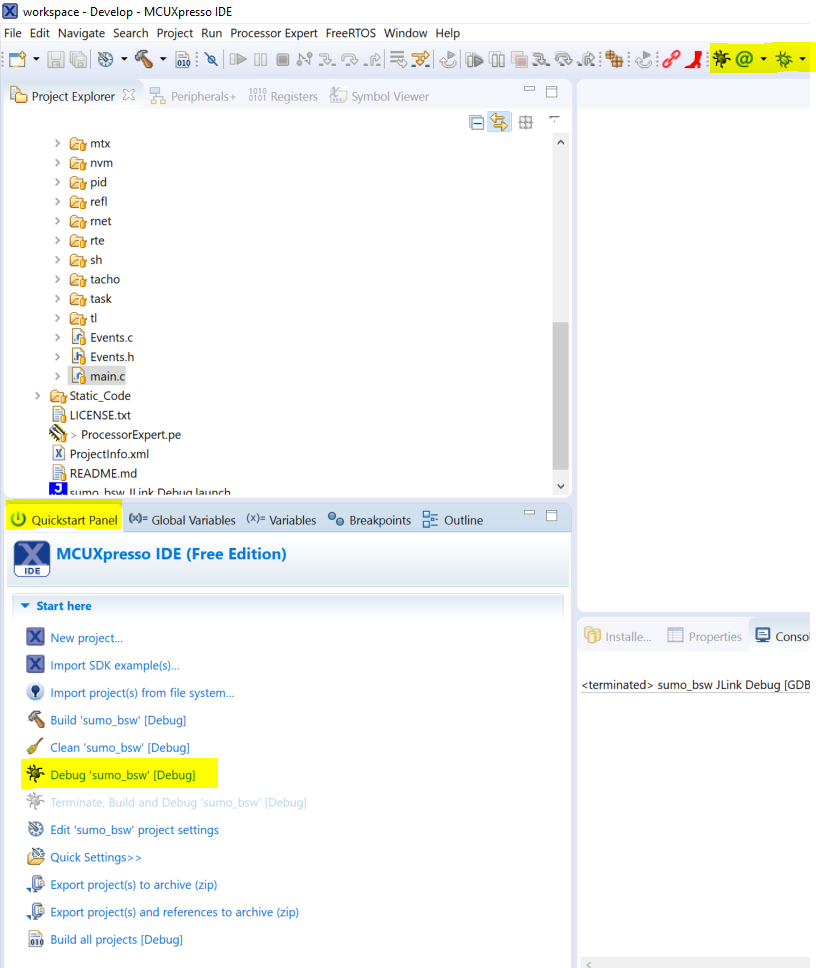

	To start debugging, hit the **blue** debug button.

If this does not work, click the arrow next to the green debug button and go to the *Debug Configurations* window. 

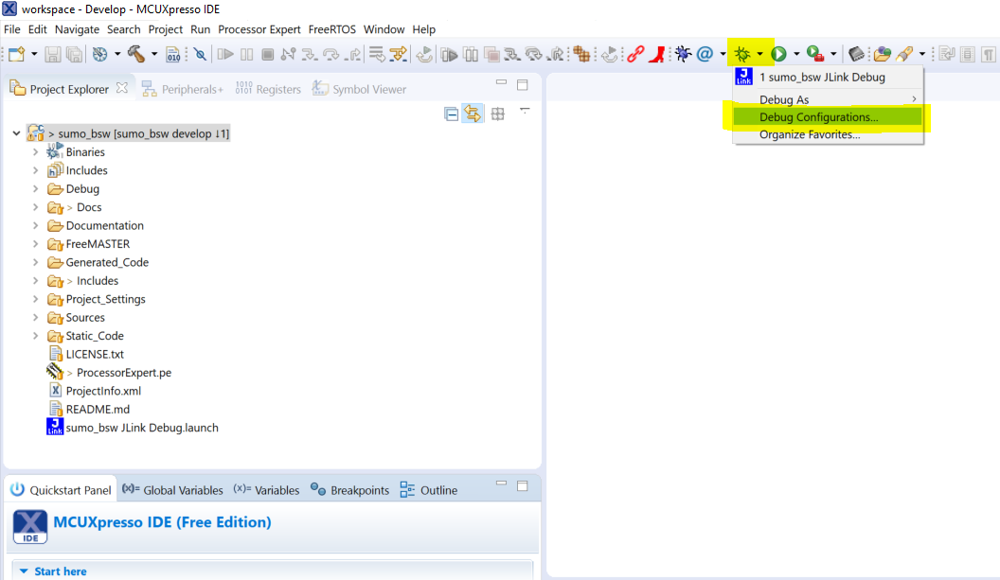

	Open the *Debug Configuration Window* if the blue button didn't work properly.
	
Make sure that under the tab *GDB Segger Interface Debugging* a configuration *sumo_bsw JLink Debug* exists and add it
if it necessary. Also compare and adjust your settings according to the pictures below. 

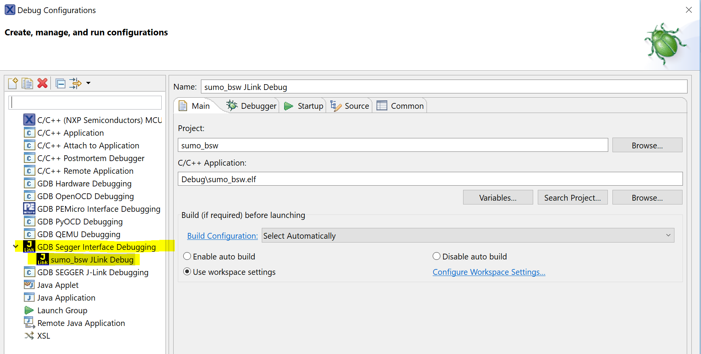

	There should be a configuration named *sumo_bsw JLink Debug* with the *C/C++ Application* set to the *sumo_bsw.elf* file.
	
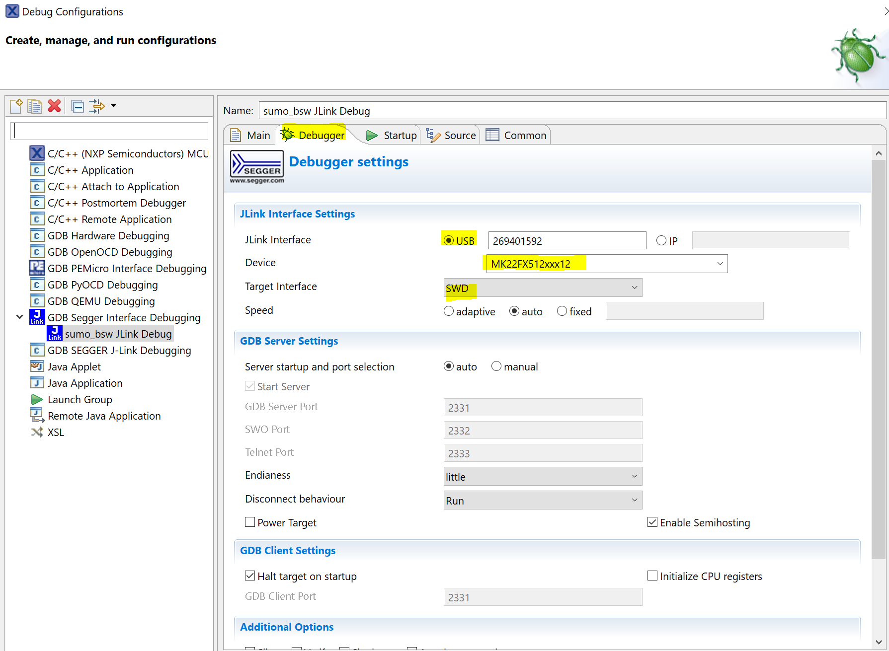
	
	In the *Debugger* tab, make sure that *Device* is set to *MK22FX512xxx12* (this is the MCU on the Sumo).
	
Now everything should work and if you hit the blue debug button again, the program is halted in the *main.c* file by default. 
In the menu toolbar, you can now see a few buttons *Resume*, *Suspend*, *Terminate*, *Step Into*, *Step Over* and *Step Return*.
Their functions are briefly described in the following table:

	=========== ========
	Name        Function
	=========== ========
	Resume      Resumes the program up to the next breakpoint
	Suspend     Halts the program at the point where it is when you press suspend
	Step Into   Jumps to the function body of the current line when pressed. Jumps over the current line if it is not a function
	Step Over   Jumps to the next line of code 
	Step Return Exits the current function body to the point from where it was called
	=========== ========
	
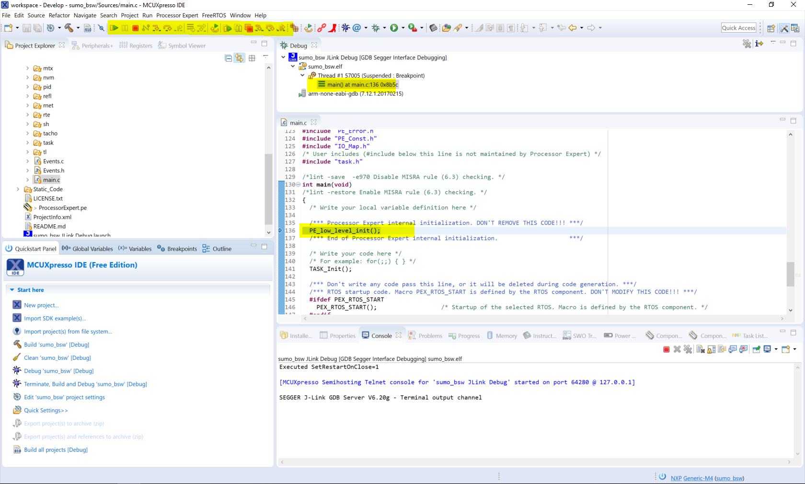
	
	A successful invocation of the debug session starts at the *main.c* file.

As an example of the basic features of the debug process, the *debug view* is shown in the figure below. 
The debug window provides you with information about local variables that are on the stack in the current scope. In this example, 
these are used in the function *KF_Predict_x* and their values are shown in the upper right quadrant of the screen. In the *Global Variables*
tab, you can also specify global variables that you want to see. For instance, the global variable *data* is shown here, which is part of the 
*tacho* component. In addition, you can see and set breakpoints in the *Breakpoint* tab. You can also set a breakpoint by 
double-clicking the blue column next to the line numbers.

.. note:: If MCUXpresso does not show this view automatically when starting a debug session, you can get to it by clicking the 
	debug icon in the upper left corner of the window. 

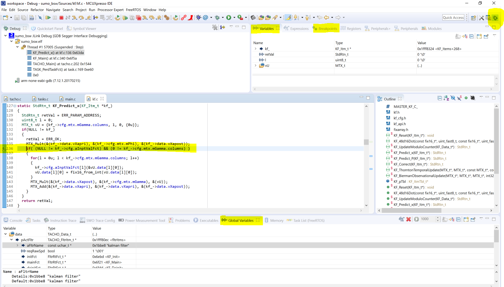

	An example of how the *debug view* works. You can see the current instruction pointer is at line 136. You can also see local and global
	variables that are used in this scope aswell as other useful information.

Another useful feature is the *FreeRTOS->Task List* view. With this, you can see stack usage, priority, state, and runtime of all the different tasks that run
on the Sumo. For an example, see the figure below.

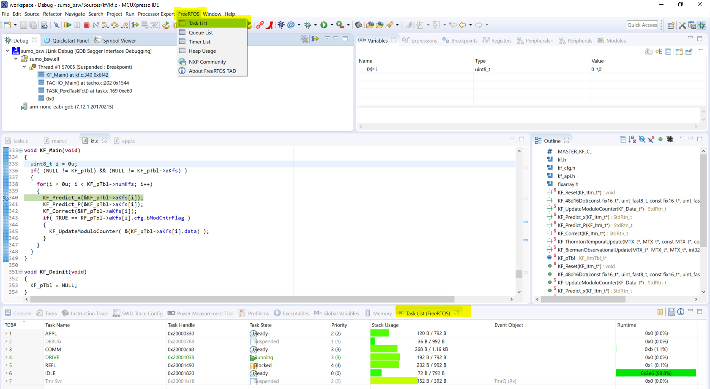
	
	In the *Task List* view of FreeRTOS, you can see useful information about the current stack usage, state, etc. of the tasks running on the Sumo.
	For example, the *DRIVE* task uses 192 byte of the 792 byte it is allowed to use on the stack memory.

Finally, if you want to change settings on Processor Expert components, go to *Processor Expert->Show Views*. In this view, you can see all components
for which Processor Expert produces code (which will be in the folder *Generated Code*). Right-clicking a component and selecting *Inspector* brings you
to a view where you can change settings for this particular component.

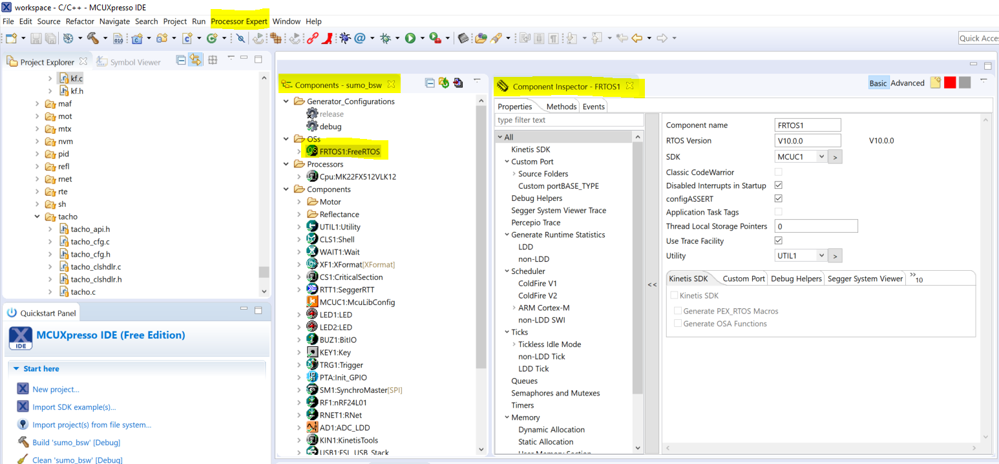

	The *Component View* of Processor Expert, where you can see and change settings of particular components aswell as generate Processor Expert code.
	
.. note:: This is only a very brief introduction of the functionality that is provided for debugging code in MCUXpresso. For further details, have a look
	at Erich Stygers `blog entry <https://mcuoneclipse.com/2017/03/28/mcuxpresso-ide-unified-eclipse-ide-for-nxps-arm-cortex-m-microcontrollers/>`_ for the 
	MCUXpresso IDE and also take a look at the `MCUXpresso IDE User Guide <https://www.nxp.com/docs/en/user-guide/MCUXpresso_IDE_User_Guide.pdf>`_.
	
.. _Communicating via J-Link RTT Viewer:

Communicating via J-Link RTT Viewer
===================================
This is a tool that is used to obtain and change settings from several components of the Sumo software such as FreeRTOS, Motor, Drive, Tacho, PID controller,
quadrature encoders, buzzer, LEDs, battery, reflectance sensor array, and a few more. To set up a connection with the Sumo, connect it through the *J-Link 
Debug Probe* and open the application *J-Link RTT Viewer*. You are now asked to set the connection type. Adjust the settings according to the figure below.

.. figure:: images/rtt/connection.PNG
	:align: center
	
	To set up the connection through the *J-Link Edu Debug Probe*, adjust the settings accordingly.

Afterwards, press the button closest to the debug connection for approximately 1 second. You should here a beeping sound coming from the Sumo. In the 
*RTT Viewer*, a welcome message will appear as shown below. 

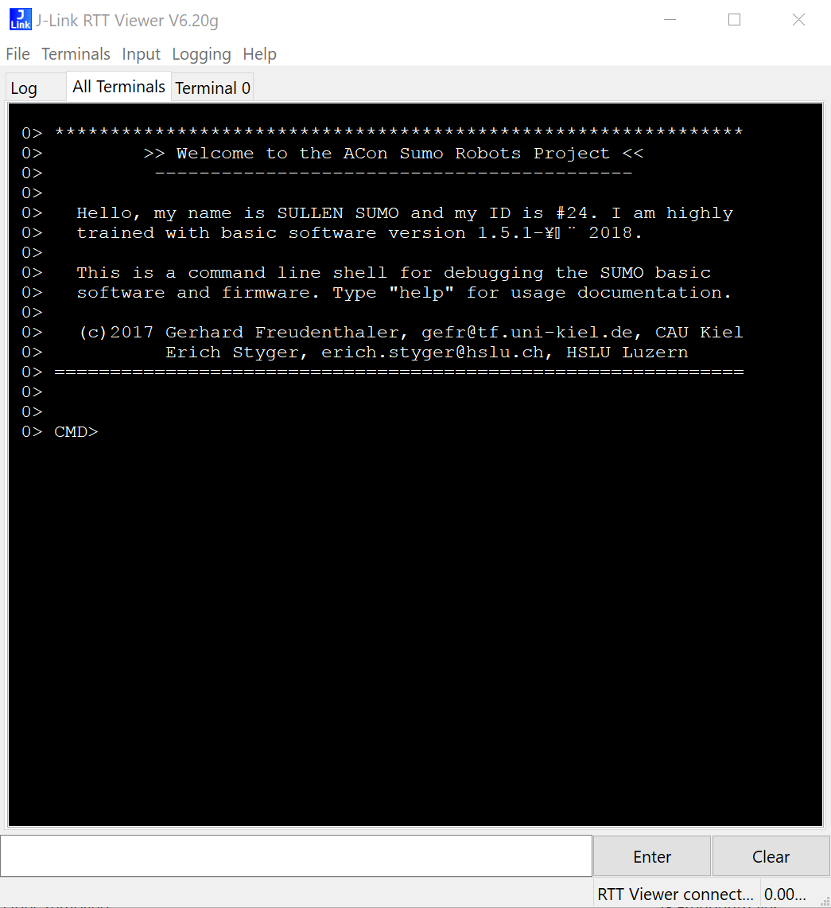

	After pressing the button on the Sumo, a welcome message will appear in the *RTT Viewer*.

If you type *help*, you will see a list of all components that you can address. For instance, if you wanted to set the speed of the left track to
900 steps/second (which is 1 revolution/second) you would type *drive mode speed* to set the drive component to the necessary state. Afterwards, you would
type *drive speed 900 0*. This will set the speed to the desired value of 900 steps/second. In this manner, you can communicate with the Sumo robot in 
whatever way you see fit.

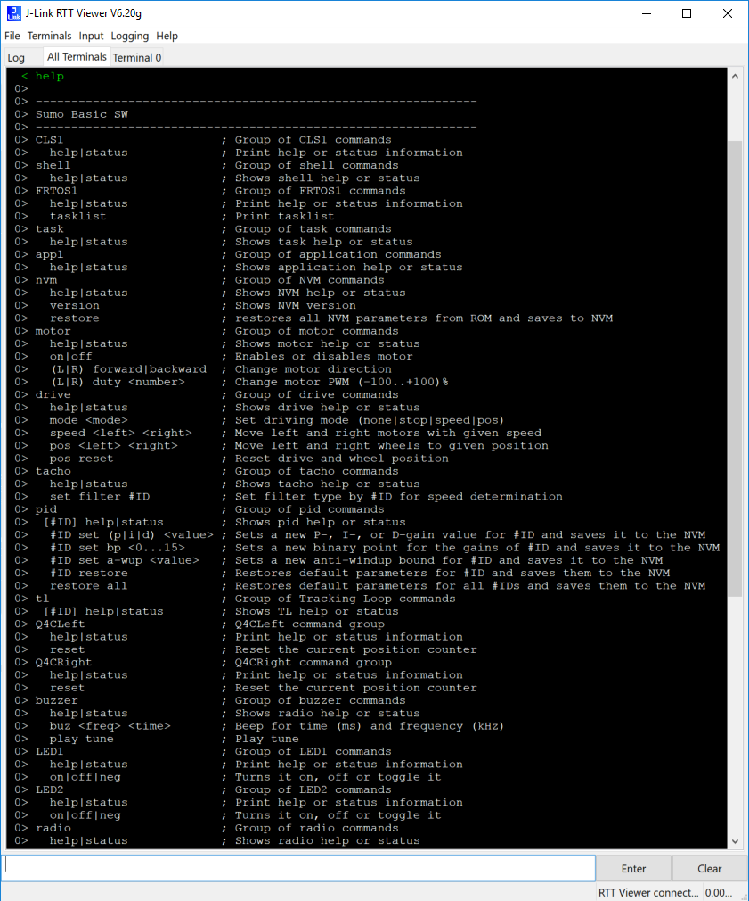

	After typing *help* to the console, the Sumo responds with a list of all possible commands that you can enter.

.. _Debugging with FreeMaster:	

Debugging with FreeMaster
=========================
FreeMaster is a very versatile tool to show the data coming from your Sumo. In principle, there are two ways (that have been tested) to establish
a communication with the Sumo robot, one of which works with the *J-Link Edu Debug Probe* attached to the Sumo and one without any attachements, which is
useful if you want to debug data while driving around. For both these connection types, you need to tell FreeMaster where your *elf* file is located. For this,
select *Project->Options* go to the *MAP Files*-tab and click the three dots. Then browse to the workspace the Sumo project is in and go to the *Debug*-folder where
you select the *sumo_bsw.elf*-file and confirm. 

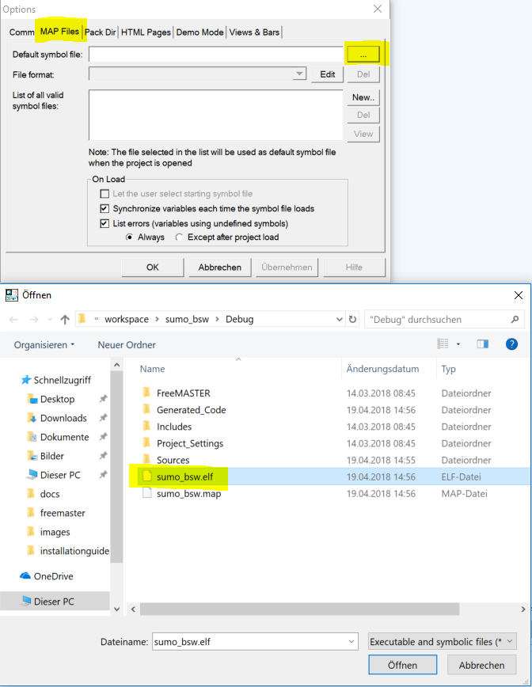
	
	Set the *elf* file location in *Project->Options* by browsing to the *Debug* folder in the workspace.

1. Connection using *J-Link Edu Debug Probe*
	Go to *Tools->Connection Wizard* and select *Connect through a debugger probe or on-board debugger interface*. In the next window, select *J-Link or J-Trace
	interface from Segger Microcontroller*. Click on *Plug-in Configuration* and confirm.
	
	.. figure:: images/freemaster/debuggerconnection.PNG
		:align: center
		
		If you want to use the debug probe, select this configuration.
	
	.. figure:: images/freemaster/bdmcommunication.PNG
		:align: center

		Since we use a J-Link device, adjust the settings accordingly.
		
	.. figure:: images/freemaster/jlinkdll.PNG
		:align: center

		Click your way through the *JLinkARM.dll* plug-in configuration.
		
2. Connection through Bluetooth
	
Now that a connection is established, go ahead and right-click *New Project* in the *Project Tree* and select *Create Scope*. As an example, a scope is set up to 
plot the velocity of the left track of the Sumo as a function of time. To do this, set the *Period* to 0 ms. This way, FreeMaster polls the data as fast as it can.

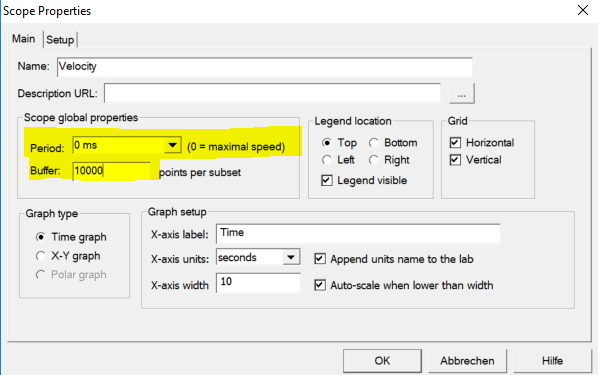

	General scope settings for a velocity scope.
	
Now the (global) variable is assigned to this scope by switching to the *Setup* tab in the *Scope Properties* window, clicking on the three dots and on *Generate*
subsequently. This will open a window containing all global variables of the Sumo robot. Search for *data.fltrdSpd\[0\]* which corresponds to the speed of the left
track (see *tacho.c*). Finally, confirm your selection by clicking *Generate single variables*. This process is shown in the figure below.

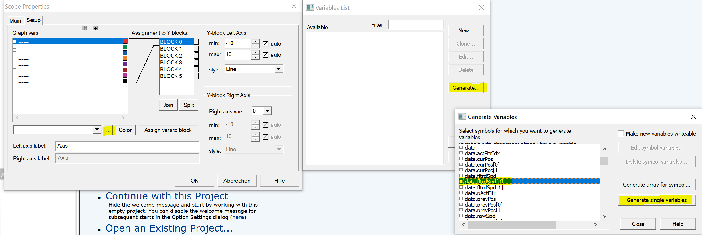
	
	How to assign the global variable containing the speed to the velocity scope.
	
Some final adjustments to the variable must be done in the *Variables List* window because by default, FreeMaster assumes this variable to be of type unsigned
int when in reality it is of type signed int. Additionally, set the *Sampling Period* to *fastest*. To do this, click *Edit* and adjust the settings as shown
in the figure below.

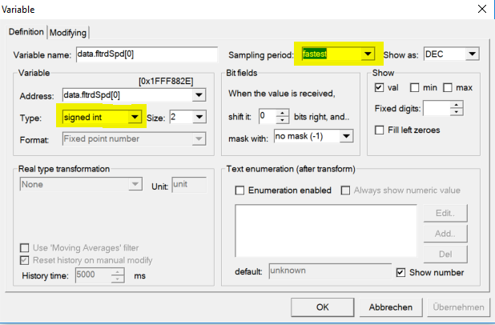
	
	Adjust the variable to be of type signed int and change the *Sampling period* to *fastest*.

If you now set a speed using the *RTT Viewer* you can view the changes in FreeMaster. 

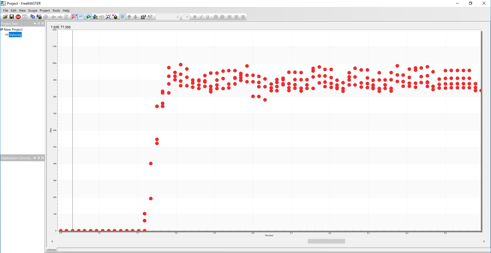

	Example capture after speed was set with the *RTT Viewer* to 900 steps/second.
	
If you want to export this captured data for further analysis, e.g. in MATLAB, FreeMaster provides a data capture option. You can set this up by changing the 
output directory to a path you like. To do this, go to *Scope->Data Capture Setup* and select the path of the **scope** accordingly. 

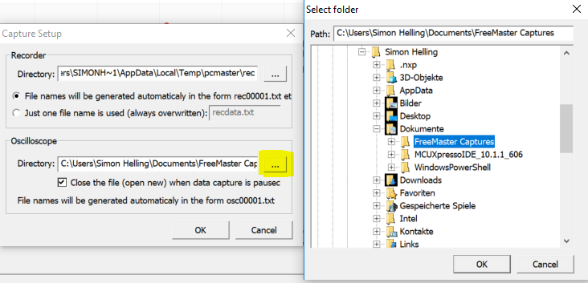

	Specify the output directory where data captures will be saved as *.txt* files. 
	
If you now click *Toggle Data Capture* in the normal FreeMaster window, a *.txt* file will be generated in that path containing all the data you put in the scope. 
You can now easily import this file to MATLAB.
	
.. hint:: To avoid making these settings every time you start FreeMaster, consider saving your FreeMaster project somewhere.